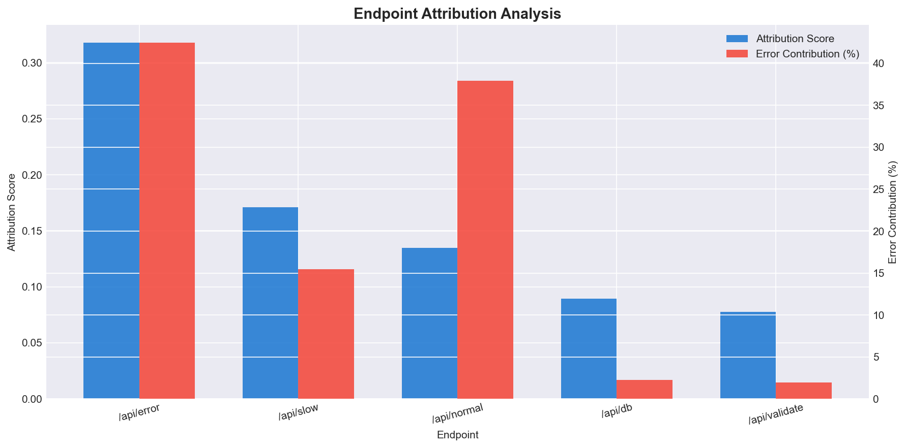
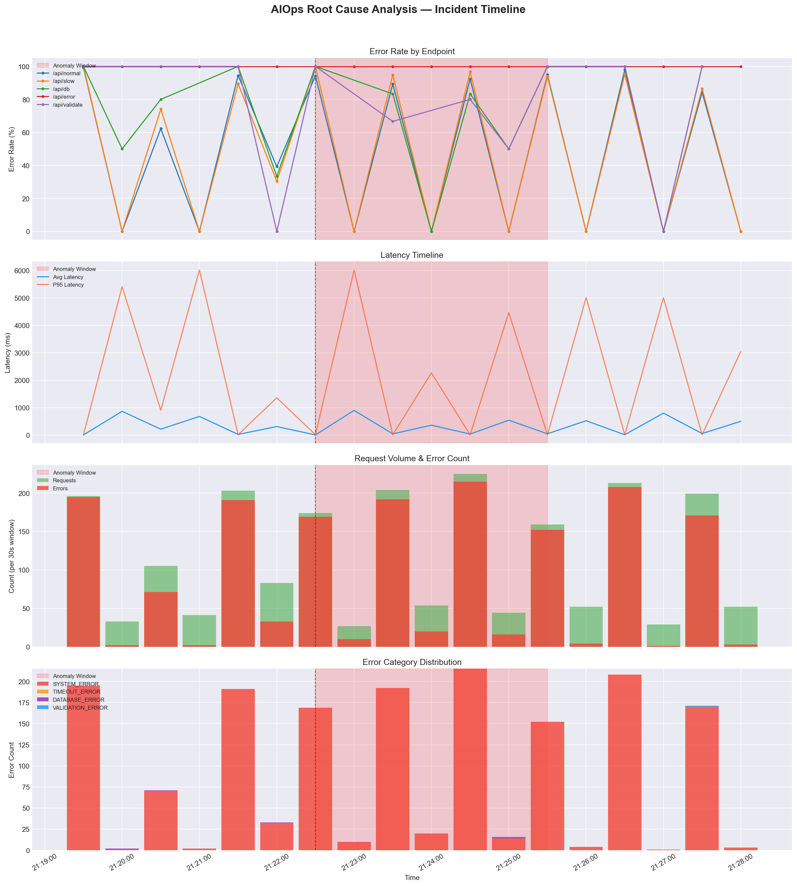

# Root Cause Analysis Report

## Lab Work 4 — AIOps Root Cause Analysis

---

## 1. Incident Summary

| Field                | Value                                              |
| -------------------- | -------------------------------------------------- |
| **Incident ID**      | `387860db-cf5b-4c25-a785-c82f910d6123`             |
| **Anomaly Window**   | 2026-03-09 21:22:30 UTC — 21:25:30 UTC (3 minutes) |
| **Root Cause**       | `/api/error` endpoint traffic surge                |
| **Primary Signal**   | `request_rate` — traffic share shifted 4.4% → 36.3% |
| **Error Category**   | `SYSTEM_ERROR` (99.7% of all errors)               |
| **Confidence Score** | 0.57                                               |
| **Severity**         | Critical                                           |
| **Detection Source** | Lab 3 Isolation Forest ML + Lab 2 Rule-Based Engine |

The anomaly was first detected by the Lab 3 Isolation Forest model as a sustained cluster of 6 consecutive anomalous 30-second windows (scores: -0.038 to -0.049). The Lab 2 rule-based detection engine correlated 24 related incidents during the broader traffic generation session, confirming system-wide degradation originating from the `/api/error` endpoint.

---

## 2. Signal Analysis

During the anomaly window, five key operational signals were compared against the pre-anomaly baseline:

| Signal           | Baseline     | Anomaly      | Change     |
| ---------------- | ------------ | ------------ | ---------- |
| Avg Latency (ms) | 164.7        | 115.1        | -30.1%     |
| P95 Latency (ms) | 875.0        | 13.6         | -98.4%     |
| Request Rate     | 3.7 rps      | 4.1 rps      | +10.8%     |
| Error Rate       | 74.7%        | 85.4%        | +10.7pp    |
| Error Count      | 494          | 622          | +25.9%     |

**Key Observation:** The paradoxical latency *decrease* during the anomaly is explained by the traffic composition shift. Fast-failing `/api/error` requests (47ms response time, always returning 500) replaced slower legitimate requests to `/api/slow` (2-9 second latency), dragging the aggregate latency metric down while the actual error volume surged.

---

## 3. Endpoint Attribution

The root cause analysis engine computed a composite attribution score for each endpoint based on traffic share shift, error rate delta, error volume contribution, and latency factor:

| Rank | Endpoint       | Score  | Traffic Share Delta | Error Contribution |
| ---- | -------------- | ------ | ------------------- | ------------------ |
| 1    | `/api/error`   | 0.3176 | +31.9pp             | 42.4%              |
| 2    | `/api/slow`    | 0.1710 | -5.1pp              | 15.4%              |
| 3    | `/api/normal`  | 0.1349 | -26.3pp             | 37.9%              |
| 4    | `/api/db`      | 0.0892 | -1.0pp              | 2.3%               |
| 5    | `/api/validate`| 0.0774 | +0.5pp              | 1.9%               |

**Root Cause: `/api/error`** ranked highest due to a massive +31.9pp traffic share increase (from 4.4% to 36.3% of all requests) combined with a 100% error rate, contributing 42.4% of all errors. This directly matches the Lab 1 traffic generator's anomaly injection configuration, which shifted `/api/error` distribution from 5% to 40%.



---

## 4. Error Category Analysis

| Category         | Baseline | Anomaly | Count | Delta   |
| ---------------- | -------- | ------- | ----- | ------- |
| SYSTEM_ERROR     | 99.4%    | 99.7%   | 620   | +0.3pp  |
| DATABASE_ERROR   | 0.6%     | 0.2%    | 1     | -0.4pp  |
| VALIDATION_ERROR | 0.0%     | 0.2%    | 1     | +0.2pp  |

The `SYSTEM_ERROR` category dominates at 99.7% of all errors during the anomaly window. This is consistent with HTTP 429 (Too Many Requests) and HTTP 500 (Internal Server Error) responses from the Laravel application under the injected error spike. The overwhelming dominance of a single error category confirms a systemic issue rather than distributed failures.

---

## 5. Incident Timeline

```
  21:19:30 ──────── NORMAL STATE ────────── 21:22:30
                     Error Rate: 74.7%
                     Avg Latency: 164.7ms
                     /api/error traffic: ~4.4%

  21:22:30 ──────── ANOMALY START ─────────
                     /api/error traffic surges to 28.2%
                     SYSTEM_ERROR errors begin escalating
                     Isolation Forest score drops to -0.038

  21:22:30 ──────── PEAK INCIDENT ─────────
                     Error rate hits 97.1%
                     /api/error traffic peaks at ~39.7%
                     622 total errors in the window

  21:25:30 ──────── RECOVERY ──────────────── 21:28:30
                     /api/error traffic returns to baseline (~5%)
                     Error rates normalize within 1-2 windows
                     System stabilizes to pre-anomaly baseline
```



---

## 6. Root Cause Determination

### Finding

The root cause of the incident was a **deliberate traffic redistribution** that massively increased the request volume to the `/api/error` endpoint. The endpoint's traffic share surged from 4.4% to 36.3% (a +31.9pp shift), while its inherent 100% failure rate (HTTP 500 responses classified as `SYSTEM_ERROR`) caused 42.4% of all errors during the anomaly window.

### Confidence Factors

| Factor                     | Score | Rationale                                    |
| -------------------------- | ----- | -------------------------------------------- |
| Error Contribution Clarity | 0.85  | 42.4% of errors from single endpoint         |
| Traffic Share Shift         | 1.00  | +31.9pp exceeds 15pp threshold               |
| ML Detection Agreement     | 1.00  | Isolation Forest confirmed anomaly cluster    |
| Error Rate Spike Magnitude | 0.00  | Endpoint already had 100% error rate          |
| Incident Correlation       | 0.00  | Lab 2 incidents from different session window |

### Recommended Action

1. **Investigate `/api/error`** for persistent `SYSTEM_ERROR` failures and fix the underlying HTTP 500 response.
2. **Implement rate limiting** on the `/api/error` endpoint to prevent traffic surges from cascading.
3. **Add circuit breakers** to isolate failing endpoints from impacting system-wide error metrics.
4. **Deploy alerting** on per-endpoint traffic share shifts exceeding 15pp within a 1-minute window.

---

## 7. Deliverables

| Artifact                 | File                   | Description                                       |
| ------------------------ | ---------------------- | ------------------------------------------------- |
| RCA Script               | `root_cause_analysis.py` | Automated analysis pipeline                     |
| Structured RCA Report    | `rca_report.json`      | Machine-readable RCA output with all evidence     |
| Incident Timeline Chart  | `rca_timeline.png`     | 4-panel visualization (error rate, latency, volume, categories) |
| Endpoint Attribution     | `rca_attribution.png`  | Attribution score vs error contribution chart     |
| RCA Report Document      | `RCA_REPORT.md`        | This document                                     |
