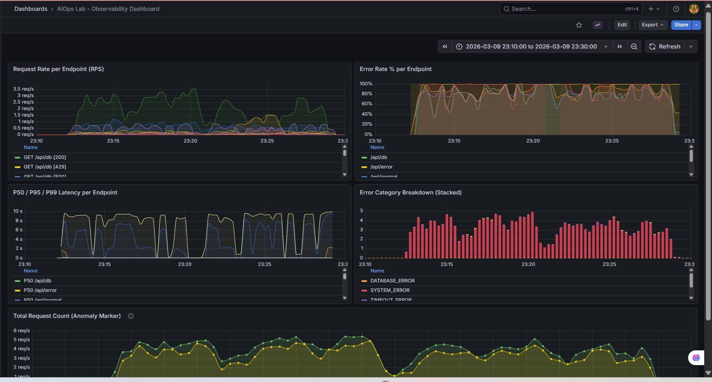
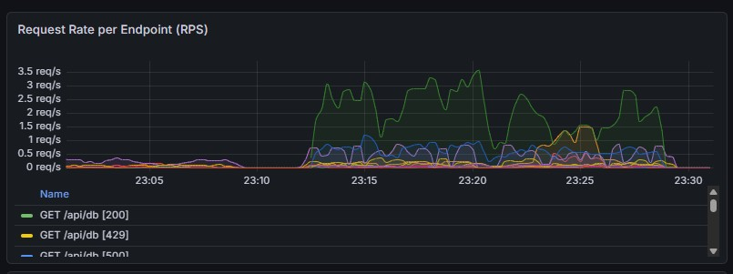
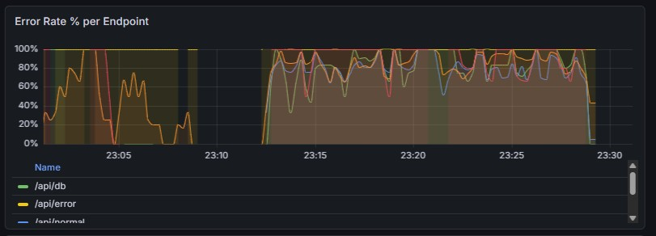
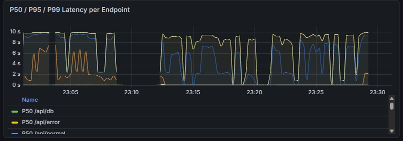
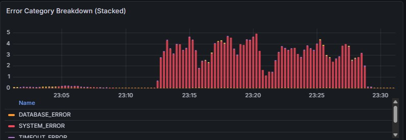
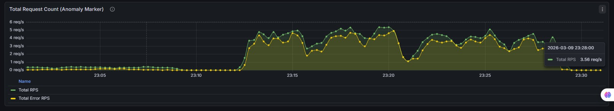

# 1. Log Schema Design

The structured JSON log schema was designed to support automated parsing, ML anomaly detection, and incident triaging.

- `timestamp`: Standardized ISO 8601 formatting for time-series analysis and sorting.
- `severity`: Standard levels (`info`, `error`) for basic log filtering and alerting rules.
- `message`: A human-readable summary of the event.
- `context`: A nested object ensuring variable data does not pollute the top-level schema.
    - `request_id`: Correlation ID linking logs to the same request trace.
    - `method`: HTTP method used (GET, POST), essential for identifying usage patterns.
    - `path`: Endpoint hit (e.g., `/api/slow`), vital for per-route analysis.
    - `status_code`: HTTP response code, the primary indicator of request success or failure.
    - `latency_ms`: Response time in milliseconds, required for SLA monitoring and performance drift detection.
    - `client_ip`: Origin IP, useful for identifying localized issues or abuse.
    - `user_agent`: Client type, helping track issue scope across platforms/devices.
    - `query`: Request query parameters to identify inputs causing slow/failed requests.
    - `payload_size_bytes` & `response_size_bytes`: Bandwidth and payload size tracking.
    - `route_name`: Internal framework route identifier.
    - `host`: Server handling the request.
    - `build_version`: Application version to correlate anomalies with recent deployments.
    - `error_category`: Centralized, limited-cardinality categorization (`VALIDATION_ERROR`, `DATABASE_ERROR`, `TIMEOUT_ERROR`, `SYSTEM_ERROR`) essential for root-cause analysis without parsing stack traces.

# 2. Metrics Design

Prometheus RED (Rate, Errors, Duration) metrics were implemented to provide aggregate health visibility.

- **Labels** (`method`, `path`, `status`, `error_category`): Kept intentionally simple and limited in cardinality. High-cardinality data like `request_id` or `client_ip` are excluded to prevent Prometheus performance degradation.
- **Duration Buckets**: Defined as `[0.05, 0.1, 0.25, 0.5, 1, 2.5, 5, 10]`.
    - Fine granularity at the lower end (50ms - 500ms) to capture normal, fast API performance.
    - Broader thresholds at the higher end (2.5s - 10s) to effectively capture expected slow requests (like `/api/slow` taking 5-7 seconds) and timeouts.

# 3. Anomaly Design

A multi-threaded traffic generator was used to inject an "Error Spike" anomaly against the base normal traffic.

- **Controlled**: The anomaly was strictly bounded to a 2-minute window. Traffic distribution was explicitly adjusted (40% load to `/api/error` compared to the base 5%) using a precise Python script evaluating distribution probabilities.
- **Visible**: The sharp increase in error rate was guaranteed by overriding the base random endpoint selection weights with the heavily-skewed anomaly distribution matrix during the specified window.

# 4. Evidence of Complete Stack Operation

## Full Monitoring Overview (With Anomaly Annotation)

## Request Rate per Endpoint (RPS)

## Error Rate % per Endpoint

## P50 / P95 / P99 Latency per Endpoint

## Error Category Breakdown (Stacked)

## Total Request Count (Anomaly Marker)

